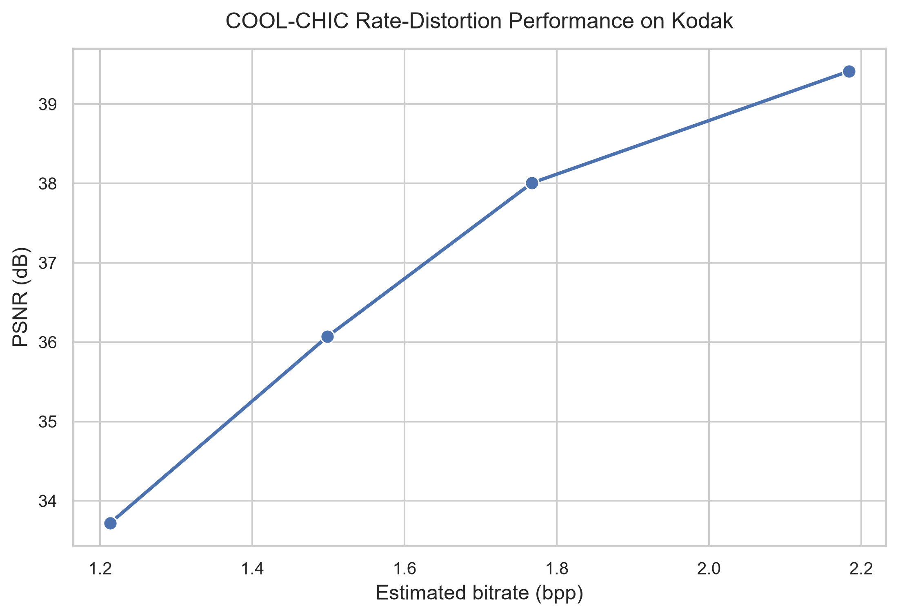
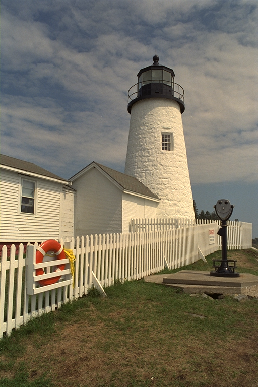
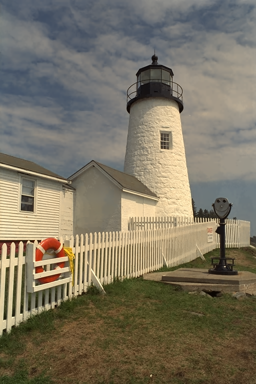
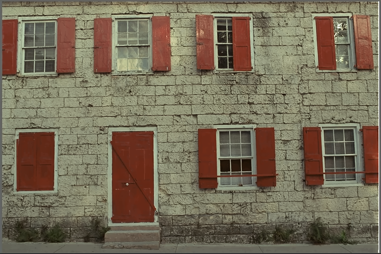
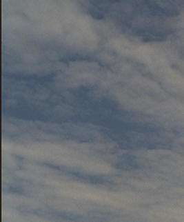
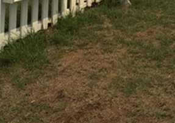
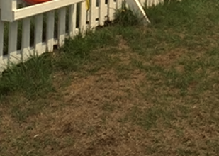

# COOL-CHIC Reimplementation

A minimal, paper-based PyTorch reimplementation of **COOL-CHIC (Coordinate-based Low Complexity Hierarchical Image Codec)** focused on understanding the original architecture, single-image overfitting, and rate-distortion evaluation on Kodak.

> [!IMPORTANT]
> **This implementation reports entropy-model-estimated bitrate and does not generate a real entropy-coded bitstream.**  
> `model.pt` is a PyTorch research checkpoint containing the learned image representation. It is **not** a compressed bitstream, and its file size must not be interpreted as bitrate.

## Overview

This project keeps the original COOL-CHIC idea intentionally small and readable:

- 7 hierarchical latent grids
- bicubic latent upsampling and channel concatenation
- synthesis MLP: `7 → 12 → 12 → 3`
- 12-pixel causal spatial context
- probability MLP: `12 → 12 → 12 → 2`
- discretized Laplace latent-rate model
- single-image rate-distortion optimization
- post-training quantization of synthesis and probability MLP parameters
- final rate reported as **estimated bpp = (latent bits + MLP bits) / pixels**
- Kodak benchmark CSVs and a PSNR-vs-estimated-bpp curve

The implementation is deliberately a **research reimplementation**, not a production codec.

## Architecture

```text
                         single input image
                                │
                                ▼
                    optimize one image at a time
                                │
                ┌───────────────┴───────────────┐
                │                               │
                ▼                               ▼
       7 hierarchical latents          causal probability model
      H×W ... H/64×W/64                  12 → 12 → 12 → 2
                │                               │
          quantize / round                 μ, σ (Laplace)
                │                               │
       bicubic upsample                     estimated
          + concatenate                    latent bits
                │
         [1, 7, H, W]
                │
                ▼
       synthesis MLP
        7 → 12 → 12 → 3
                │
                ▼
       RGB reconstruction
```

## Rate-distortion result

The benchmark aggregates each lambda over the selected Kodak images and plots the mean PSNR against the mean **estimated bpp**.

<p align="center">
  
</p>

Current benchmark snapshot:

| λ | Mean estimated bpp | Mean PSNR (dB) | Images |
|---:|---:|---:|---:|
| 0.0008 | 1.213 | 33.718 | 4 |
| 0.0004 | 1.499 | 36.069 | 4 |
| 0.0002 | 1.767 | 38.006 | 4 |
| 0.0001 | 2.184 | 39.413 | 4 |

These values are results from this reimplementation and its experiment settings; they are **not claimed to reproduce the exact numbers reported by the original authors**.

## Reconstruction examples

### Kodak `kodim19`

<table>
  <tr>
    <th width="50%">Original</th>
    <th width="50%">Reconstruction</th>
  </tr>
  <tr>
    <td align="center"></td>
    <td align="center"></td>
  </tr>
</table>

### Kodak `kodim01`

<table>
  <tr>
    <th width="50%">Original</th>
    <th width="50%">Reconstruction</th>
  </tr>
  <tr>
    <td align="center"></td>
    <td align="center"></td>
  </tr>
</table>

## Local detail comparison

<table>
  <tr>
    <th>Region 1</th>
    <th>Region 2</th>
    <th>Region 3</th>
    <th>Region 4</th>
  </tr>
  <tr>
    <td align="center"><br><sub>Original</sub></td>
    <td align="center"><br><sub>Original</sub></td>
    <td align="center"><br><sub>Original</sub></td>
    <td align="center"><br><sub>Original</sub></td>
  </tr>
  <tr>
    <td align="center"><br><sub>Reconstruction</sub></td>
    <td align="center"><br><sub>Reconstruction</sub></td>
    <td align="center"><br><sub>Reconstruction</sub></td>
    <td align="center"><br><sub>Reconstruction</sub></td>
  </tr>
</table>

## Setup

### Linux / macOS

```bash
python -m venv .venv
source .venv/bin/activate
pip install -r requirements.txt
```

### Windows PowerShell

```powershell
python -m venv .venv
.\.venv\Scripts\Activate.ps1
pip install -r requirements.txt
```

For CUDA acceleration, install the PyTorch build appropriate for your CUDA environment before running the experiments.

## Kodak dataset

Place Kodak PNG images under:

```text
data/kodak/
├── kodim01.png
├── kodim02.png
├── ...
└── kodim24.png
```

The dataset is not redistributed by this repository. The Kodak image set referenced by the COOL-CHIC paper is available from the Kodak image dataset website.

## Quick start

### Optimize one image

```bash
./encode.sh data/kodak/kodim19.png
```

The wrapper forwards all additional arguments to `scripts/train.py`, so experiment settings can still be overridden:

```bash
./encode.sh data/kodak/kodim19.png \
  --steps 40000 \
  --lambda-rd 0.0002 \
  --lr 0.01
```

Typical output:

```text
results/kodim19/
├── model.pt
├── reconstruction.png
└── metrics.json
```

`model.pt` stores the optimized research representation. It is **not** an entropy-coded file.

### Reconstruct from a checkpoint

```bash
./decode.sh results/kodim19/model.pt
```

This writes:

```text
results/kodim19/decoded.png
```

Because the checkpoint already stores the optimized representation, this reconstruction path does not perform entropy decoding from a compressed stream.

### Run the Kodak benchmark

```bash
./benchmark.sh
```

Expected benchmark artifacts:

```text
results/
├── kodak_results.csv
├── kodak_summary.csv
└── kodak_rd_curve.png
```

## Repository structure

```text
coolchic-reimplementation/
├── configs/
│   ├── debug.yaml
│   ├── train.yaml
│   └── benchmark.yaml
├── data/
│   └── kodak/
├── src/
│   └── coolchic/
│       ├── data/
│       │   └── image_io.py
│       ├── models/
│       │   ├── latent.py
│       │   ├── synthesis.py
│       │   ├── context.py
│       │   ├── probability.py
│       │   └── codec.py
│       ├── losses/
│       │   └── rate_distortion.py
│       └── training/
│           └── trainer.py
├── scripts/
│   ├── train.py
│   ├── reconstruct.py
│   ├── benchmark.py
│   └── plot_rd.py
├── results/
├── encode.sh
├── decode.sh
├── benchmark.sh
├── requirements.txt
└── README.md
```

## What this project does not implement

This repository intentionally does **not** contain arithmetic coding, range coding, ANS, a custom binary container, or independently decodable compressed files. Consequently, all bitrate numbers should be read as **entropy-model-estimated bpp**, not actual file bpp.

## Reference

This project is based on the architecture described in:

> Theo Ladune, Pierrick Philippe, Félix Henry, Gordon Clare, and Thomas Leguay.  
> **COOL-CHIC: Coordinate-based Low Complexity Hierarchical Image Codec.**  
> arXiv:2212.05458, 2023.

- Paper: https://arxiv.org/abs/2212.05458
- Original project: https://github.com/Orange-OpenSource/Cool-Chic

```bibtex
@article{ladune2023coolchic,
  title   = {COOL-CHIC: Coordinate-based Low Complexity Hierarchical Image Codec},
  author  = {Ladune, Theo and Philippe, Pierrick and Henry, Felix and Clare, Gordon and Leguay, Thomas},
  journal = {arXiv preprint arXiv:2212.05458},
  year    = {2023}
}
```

## Acknowledgment

This is an independent educational/research reimplementation intended to study the core COOL-CHIC method in a compact PyTorch codebase. Credit for the original COOL-CHIC method belongs to Ladune *et al.* and Orange Innovation.
